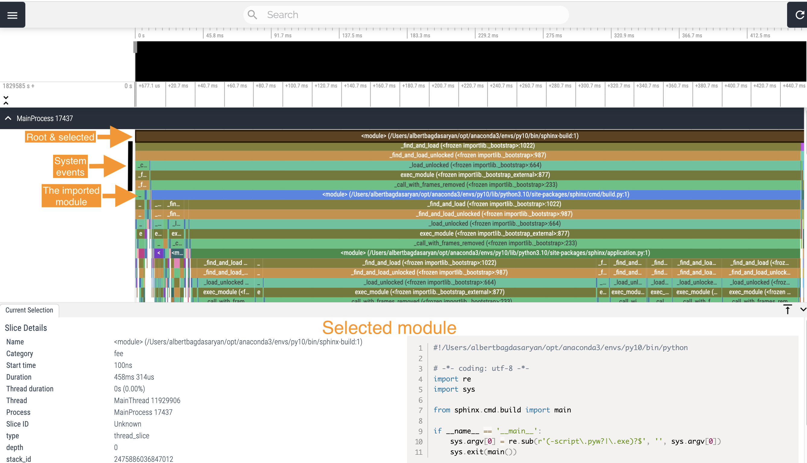
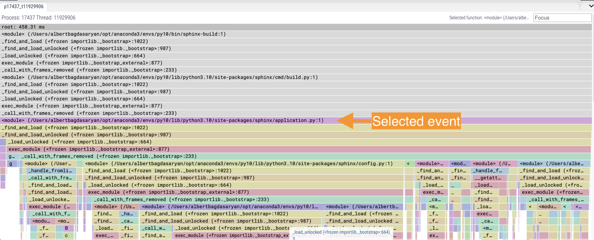

.. _research_tools:

The Tracking Tool
#################

For the results presented in this documentation,
the `VizTracer <https://github.com/gaogaotiantian/viztracer>`_ Python package was used as the main research tool.

Overview
========

There are various ways of using the selected tool.
Generally, the process consists of two steps:

#. Run the tracer utility along with the program you need to trace. It will record the result to a JSON file.
#. Run the viewer utility to parse the result and present it as an interactive page in the browser.

You need to install the package using the pip manager as follows::

   $ pip install viztracer

Running from command line
=========================

The easiest way to trace is to insert ``viztracer`` before the command you use to run your python application.
This is especially useful when you cannot change the application.
For example, you can trace the whole documentation build process as follows::

   $ viztracer [-o <output_file>] sphinx-build -b dirhtml

The output file can be in the JSON or HTML format. You can also request a file with the ``.json.gzip`` name
extension if you need a compressed JSON file.
To reduce the trace stack, it is better to exclude from tracking all calls of C functions::

   $ viztracer --ignore_c_function sphinx-build -b dirhtml "." "_build"

By default, this utility dumps all trace results to a local file ``result.json``, for example::

   The HTML pages are in _build.
   Total Entries: 457026
   Use the following command to open the report:
   vizviewer /<path_to_the_local_folder>/result.json

As recommended in the output, run the ``vizviewer`` utility to parse and view the result::

   $ vizviewer [--port <number>] result.json

The default port number is 9001. You will find later a separate section :ref:`research_tools_analysis` in this document
describing the use of the interactive viewer.

Running from code
=================

If you need to focus on a specific part of the program you research, you can insert the tracer to the corresponding
place inside the program. There are two variations on it:

*  Start and stop the process explicitly, for example::

      from viztracer import VizTracer

      tracer = VizTracer()
      tracer.start()
      # Your program code is here.
      tracer.stop()
      tracer.save() # Optionally, you can specify the output file.

*  Using the ``with`` statement, for example::

      with VizTracer(output_file="optional.json") as tracer: # The output_file is optional.
          # Your program code is here.

.. _research_tools_analysis:

Analyzing the result
====================

The ``vizvieweer`` represents a series of calls as a tree-like graph with the first called function on the root.
Every line represents a separate Python or system call, generally called an *event*.

Default presentation
--------------------

The easiest way to open the traced result is to run the viewer without any flags::

   $ vizviewer result.json

This command will render the specified JSON file and present it in the browser. After opening the MainProcess panel,
you will see the tracing graph similar to this:

Most often you will probably use the following operations with this view:

*  Select an event and see its contents on the bottom text panel.

   In this example, the root module (``sphinx-build``) is selected.

*  Find the event's ancestors and children.

   In this example, the ``sphinx-build`` imports the ``main`` function from the ``sphinx.cmd.build`` module.
   That is why, if you skip some system calls, the first custom child is the imported ``sphinx.cmd.build`` module.

*  Quickly change the graph presentation using the AWSD (no need to press SHIFT) keyboard shortcuts:

   -  ``W`` and ``S`` enable you to zoom in and zoom out the graph view.
      Notice, that on your keyboard the letter ``W`` is above the letter ``S``.
      This makes them easier to remember, because ``W`` means up, that is, expanding the view, and ``S``
      means lowering, that is reducing the view.
      If you pay attention at the black timeline at the top, you will notice that ``W`` narrows the selected time range,
      while ``S`` expands it.
   -  ``A`` and ``D`` are on the same horizontal line.
      That's why with ``A`` you move the graph view to the left, and with ``D`` you move it to the right.
      Notice that you can use these shortcuts as long as the selected time range allows you to do so.
      If it doesn't, use ``W`` beforehand to narrow the time range.

Flame Graph
-----------

A Flame Graph format might be more convenient for tracing the internal calls.
You can run it with the viewer as follows::

   $  vizviewer --flamegraph result.json

The advantage of this view seams to be that it automatically expands or contracts the time range to display
the selected event expanded on the screen:

Pay attention, this view doesn't display the contents of the selected event, unlike the method discussed earlier.

Additional resources
====================

For more details on using ``viztracer``, see the following resources:

*  `VizTracer <https://github.com/gaogaotiantian/viztracer>`_ in GitHub.
*  `VizTracer <https://viztracer.readthedocs.io/en/stable/>`_ in ReadTheDocs.

